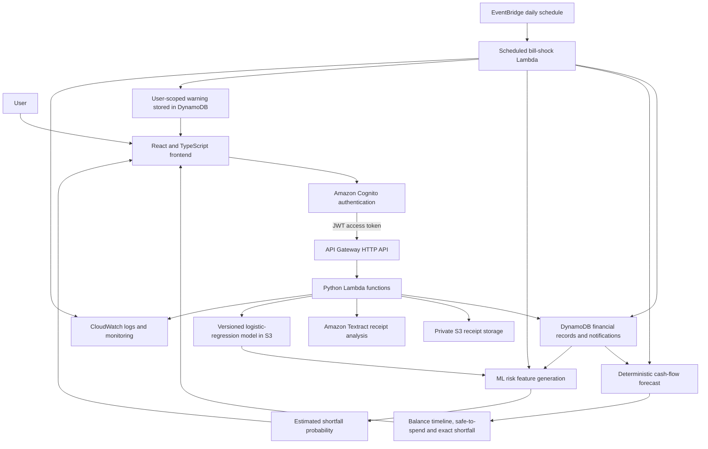

# FlowGuard

## Project description

FlowGuard is a full-stack, serverless cash-flow and bill-shock risk platform. It allows authenticated users to record expenses, expected income and future commitments; upload and scan receipts; view monthly analytics; export records as CSV; and forecast whether their balance may fall below a personal safety buffer.

The system combines two complementary calculations:

- A deterministic cash-flow forecast calculates the projected balance, lowest balance, safe-to-spend amount, first shortfall date and exact shortfall using the financial records supplied by the user.
- An explainable logistic-regression model estimates the probability of the balance falling below the safety buffer. It is trained on 12,000 synthetic account scenarios calibrated using aggregate UK Office for National Statistics Family Spending data.

FlowGuard uses React and TypeScript for the frontend and Python for the backend. Its AWS infrastructure includes Amazon Cognito, API Gateway, Lambda, DynamoDB, S3, Textract, EventBridge and CloudWatch, provisioned through AWS SAM and CloudFormation.

## Problem it solves

Traditional expense trackers mainly describe money that has already been spent. They do not clearly show whether the timing of upcoming bills and uncertain income could leave somebody short of money before their next payment arrives.

FlowGuard is designed for people such as students, freelancers, contractors and gig workers whose income or payment dates may vary. It answers three practical questions:

1. How will known income, expenses and commitments change my balance over the selected period?
2. Will my projected balance fall below the minimum safety buffer I want to preserve?
3. What is the estimated probability of a shortfall when income timing and unexpected outgoings are uncertain?

The deterministic calculation remains the source of exact balances and warning triggers. The ML probability provides supporting risk information and is not presented as a guaranteed outcome or financial advice.

## Pipeline architecture and behaviour



### Behaviour

1. Cognito signs the user in and issues a JWT access token.
2. The frontend includes the token in protected API requests.
3. API Gateway authorises the request and routes it to the relevant Lambda function.
4. Lambda validates the request and uses the authenticated Cognito user ID to isolate all DynamoDB and S3 operations.
5. DynamoDB stores expenses, income, commitments, warning settings and notifications. Private S3 storage holds receipts and the versioned ML model.
6. Textract extracts receipt merchant, date and total suggestions. The user reviews the suggestions before they are applied to an expense.
7. The deterministic forecast orders financial events by date and applies:

   ```text
   projected balance = opening balance + income - expenses - commitments
   ```

8. The logistic-regression pipeline transforms the same scenario into numerical features and returns a shortfall probability between 0% and 100%.
9. EventBridge invokes the warning Lambda daily. A notification is created only when the deterministic forecast predicts that the balance will fall below the safety buffer. The ML percentage is included as supporting information.
10. The frontend polls for unread notifications and displays the exact shortfall, safety buffer, expected date and ML risk percentage.

## Commands to run the system pipeline

### 1. Configure and deploy the AWS backend

Run these commands from the project root. AWS SAM and an authenticated AWS CLI profile named `flowguard-dev` are required.

```powershell
cd "C:\Users\Rohit Kumar\Documents\FlowGuard-A-Serverless-Cash-Flow-and-Bill-Shock-Prediction-Platform\flowguard"

sam validate --template-file infrastructure\template.yaml --lint --profile flowguard-dev --region eu-west-2
sam build --template-file infrastructure\template.yaml
sam deploy --profile flowguard-dev --region eu-west-2
```

### 2. Configure the frontend

Create `frontend\.env.local` from `frontend\.env.example` and replace its placeholders with the API URL, AWS Region, Cognito User Pool ID and Cognito application client ID shown in the CloudFormation deployment outputs.

```powershell
Copy-Item frontend\.env.example frontend\.env.local
notepad frontend\.env.local
```

Example structure:

```dotenv
VITE_API_BASE_URL=https://your-api-id.execute-api.eu-west-2.amazonaws.com/dev
VITE_AWS_REGION=eu-west-2
VITE_COGNITO_USER_POOL_ID=eu-west-2_example
VITE_COGNITO_USER_POOL_CLIENT_ID=exampleclientid
```

### 3. Run the frontend

```powershell
cd frontend
npm install
npm run dev
```

Open `http://localhost:5173`, sign in with a confirmed FlowGuard Cognito application user, and use the frontend to add financial records and run the pipeline.

### 4. Run the automated checks

Backend tests:

```powershell
cd "C:\Users\Rohit Kumar\Documents\FlowGuard-A-Serverless-Cash-Flow-and-Bill-Shock-Prediction-Platform\flowguard\backend"
.\.venv\Scripts\python.exe -m pytest tests\unit -v
```

Frontend tests and production build:

```powershell
cd "C:\Users\Rohit Kumar\Documents\FlowGuard-A-Serverless-Cash-Flow-and-Bill-Shock-Prediction-Platform\flowguard\frontend"
npm test
npm run build
```

### 5. Manually trigger the scheduled warning pipeline

```powershell
cd "C:\Users\Rohit Kumar\Documents\FlowGuard-A-Serverless-Cash-Flow-and-Bill-Shock-Prediction-Platform\flowguard\backend"

$functionName = aws cloudformation describe-stack-resource `
    --stack-name flowguard-dev `
    --logical-resource-id ScheduledBillShockFunction `
    --query "StackResourceDetail.PhysicalResourceId" `
    --output text `
    --region eu-west-2 `
    --profile flowguard-dev

$payload = @{ time = (Get-Date).ToUniversalTime().ToString("o") } | ConvertTo-Json -Compress
$eventPath = Join-Path $PWD "bill-shock-event.json"
[System.IO.File]::WriteAllText($eventPath, $payload, [System.Text.UTF8Encoding]::new($false))

aws lambda invoke `
    --function-name $functionName `
    --payload "fileb://bill-shock-event.json" `
    --region eu-west-2 `
    --profile flowguard-dev `
    bill-shock-result.json

Get-Content .\bill-shock-result.json
```

The user must have warnings enabled and a forecast scenario that falls below the safety buffer. FlowGuard creates at most one warning per user and scheduler run date, so rerunning the same date can correctly return `warnings_created: 0`.
